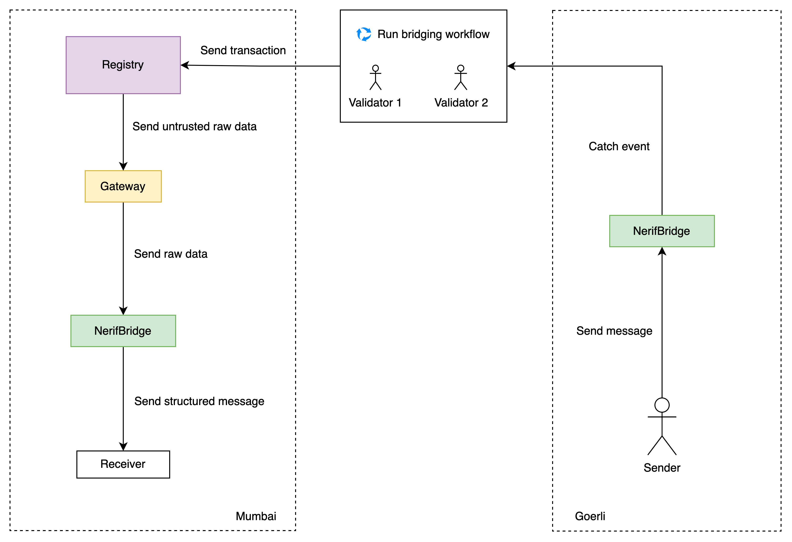

# Nerif Bridge

**DO NOT USE FOR PRODUCTION PURPOSES**

Nerif Bridge is the decentralized cross-chain bridge powered by Nerif Network.



## Set up

Bootstrapping the Nerif Bridge requires deploying several smart contracts and creating a special workflow within Nerif Network in order to power the bridge.

Bridge contracts deployment requires having [Gateway](https://github.com/nerifnetwork/contracts/blob/main/contracts/operational/Gateway.sol) contract already deployed.

### Initialize environment

First aff all, run the following command in order to create all required environment files:

```bash
$ make init
```

As a results, the following files will be created: .env, contracts-5.json, contracts-80001.json.
Replace gateway address for the real one in those .json files. Specify real values in .env file.

Now the bridge contracts can be deployed:

```bash
$ make deploy
```

As a result, [the bridge contract](./contracts/bridge/NerifBridge.sol) will be deployed on Goerli (5) and Mumbai (80001) chains.
Addresses are stored in those .json filed in the root of the repo.

### Create Nerif Network workflow

All needed contracts are deployed so those can be automated by Nerif Network.
It requires creating a bridging workflow that has the following logic:

1. Trigger workflow execution when `event Send(uint256 chainId, address target, bytes payload, uint256 gasAmount, address sender)` event is emitted on the Goerli chain within the bridge contract.
2. Add conditional step to check the given chain ID and exit the workflow if the value is not 80001.
3. Otherwise, send a transaction to the bridge contract deployed on Mumbai chain in order to execute `rec` function within the contract. Pass all required arguments coming from the event.

*Note: other steps could be added at the bridge owner's discretion.*

### Test

There is [the test receiver contract](./contracts/test/TestReceiver.sol) that can be deployed on those chains.

The following command deploys this contract on the Mumbai (80001) chain:

```bash
$ make deploy-receiver
```

Test receiver contract address is stored in the contracts-80001.json file.

Now, the first test message can be sent be executing `send` function within the bridge contract deployed on goerli.